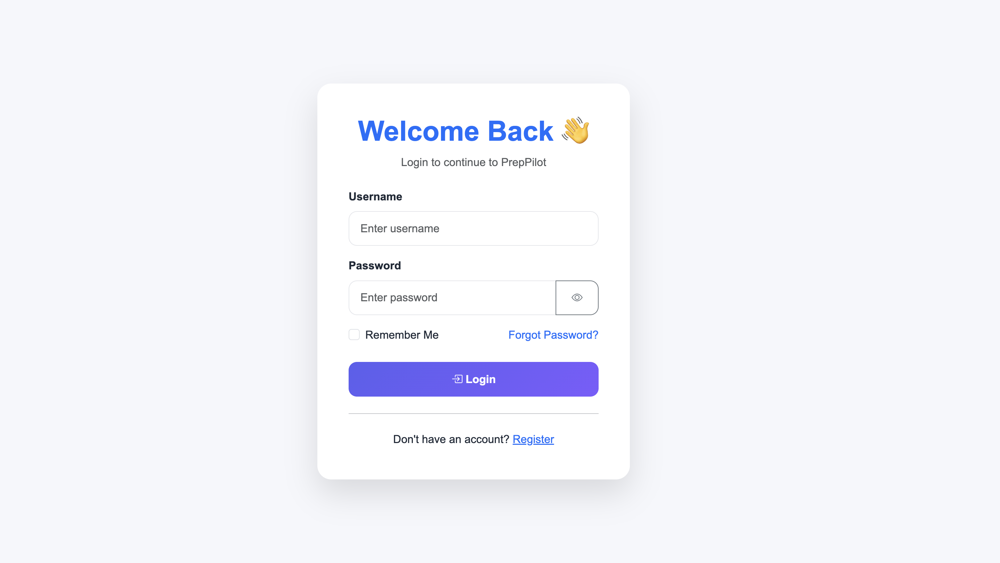
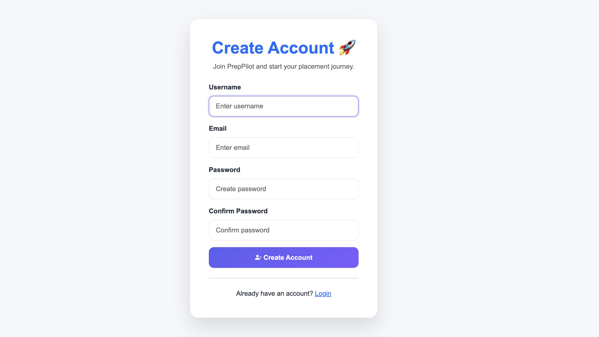
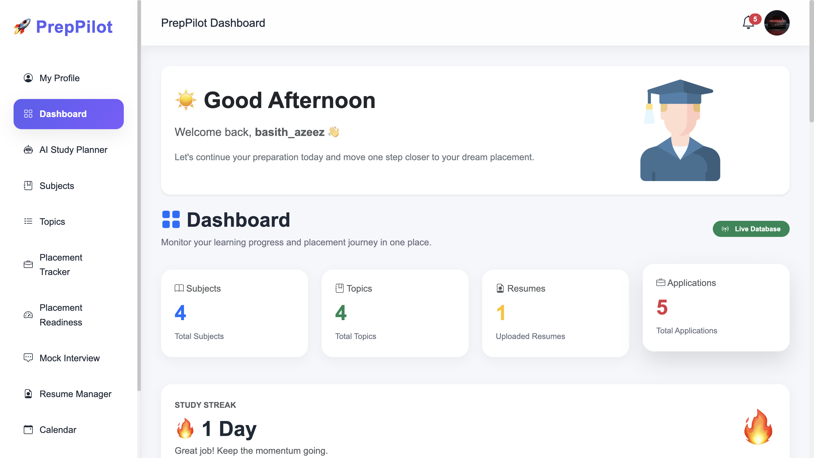
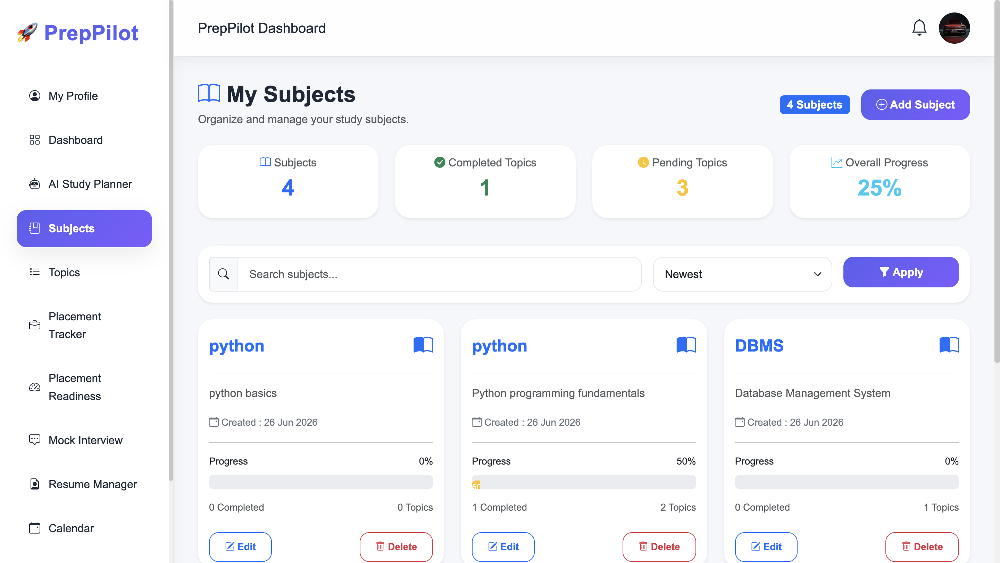
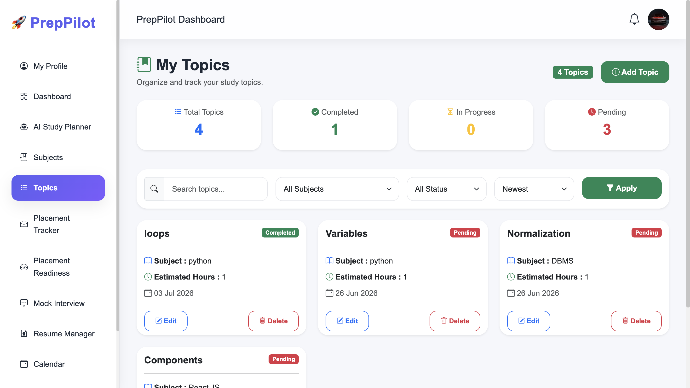
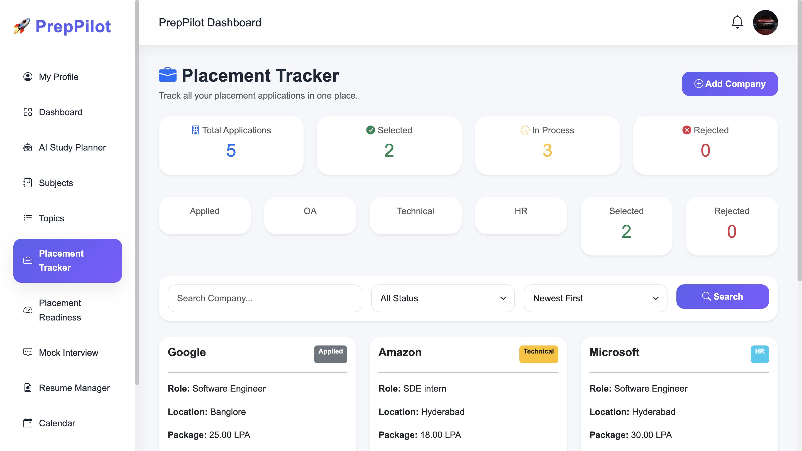
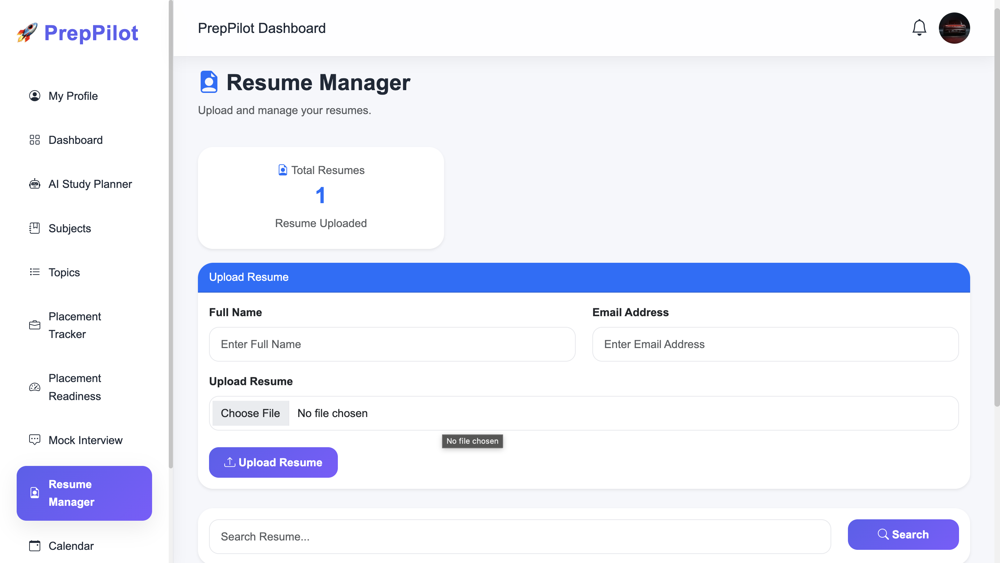
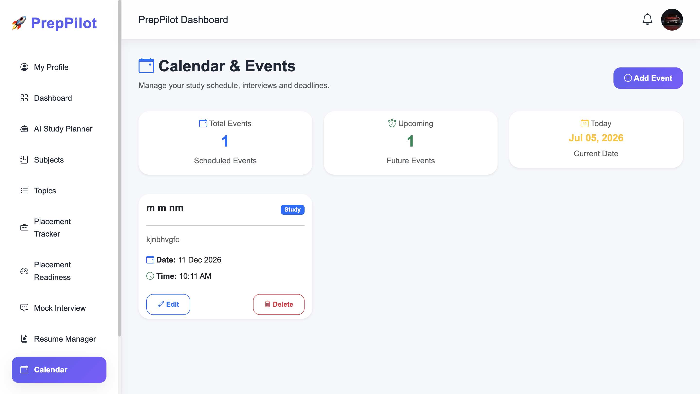
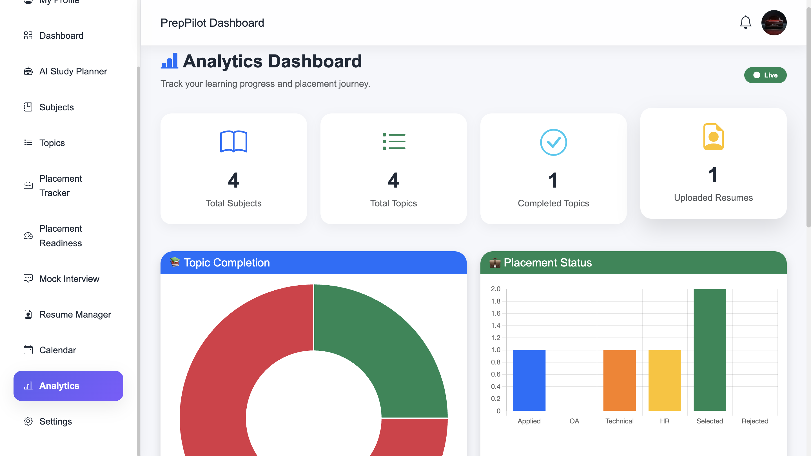

# 🚀 PrepPilot


PrepPilot is a modern AI-powered Study Planner and Placement Preparation platform built with Django. It helps students organize their learning, track placement applications, manage resumes, schedule study events, and monitor overall preparation through a responsive dashboard.

---

# 🌐 Live Demo

**Render Deployment**

https://preppilot-tx5z.onrender.com

---

# ✨ Features

## 🔐 Authentication

- User Registration
- Secure Login & Logout
- Password Change
- User Profile Management

## 📊 Dashboard

- Personalized dashboard
- Study streak tracking
- Progress overview
- Upcoming events
- Placement readiness
- Quick statistics

## 📚 Subject Management

- Create subjects
- Update subjects
- Delete subjects
- View subject details

## 📖 Topic Management

- Add study topics
- Difficulty levels
- Progress tracking
- Estimated study hours

## 💼 Placement Tracker

- Company applications
- Interview stages
- Package details
- Application status
- Placement readiness tracker

## 📄 Resume Manager

- Upload resume
- Edit resume
- Delete resume
- Download resume

## 📅 Calendar

- Study schedules
- Exam reminders
- Interview reminders
- Event management

## 📈 Analytics

- Study statistics
- Subject analysis
- Progress monitoring
- Dashboard insights

## 👤 Profile

- Profile photo
- Personal details
- College information
- Social links

## ⚙️ Settings

- Theme preferences
- Dark mode
- Account settings

## ❌ Custom Error Pages

- Custom 404 Page
- Custom 500 Page

---

# 🛠 Tech Stack

### Backend

- Python
- Django
- SQLite

### Frontend

- HTML5
- CSS3
- Bootstrap 5
- Bootstrap Icons
- JavaScript

### Tools

- Git
- GitHub
- Render

---

# 📂 Project Structure

```text
PrepPilot
│
├── preppilot/
├── studyplanner/
├── static/
│   ├── css/
│   ├── js/
│   └── images/
├── templates/
├── uploads/
├── manage.py
├── requirements.txt
└── README.md
```

---

# 🚀 Installation

Clone the repository

```bash
git clone https://github.com/basith670/PrepPilot.git
```

Move into the project

```bash
cd PrepPilot
```

Create a virtual environment

```bash
python -m venv env
```

Activate the environment

### Windows

```bash
env\Scripts\activate
```

### macOS / Linux

```bash
source env/bin/activate
```

Install dependencies

```bash
pip install -r requirements.txt
```

Run migrations

```bash
python manage.py migrate
```

Start the development server

```bash
python manage.py runserver
```

Open your browser:

```
http://127.0.0.1:8000/
```

---

# 📷 Screenshots

## 🔐 Login



---

## 📝 Register



---

## 📊 Dashboard



---

## 📚 Subjects



---

## 📖 Topics



---

## 💼 Placement Tracker



---

## 📄 Resume Manager



---

## 📅 Calendar



---

## 📈 Analytics



# 🔮 Future Enhancements

- AI-powered study recommendations
- AI resume analyzer
- Mock interview assistant
- Email notifications
- REST API
- React frontend
- PostgreSQL database
- Mobile application

---

# 👨‍💻 Developer

**Muhammad Basith K**

B.Tech Computer Engineering

SRM Institute of Science and Technology

GitHub: https://github.com/basith670

---

# 📄 License

This project was developed for educational and portfolio purposes.